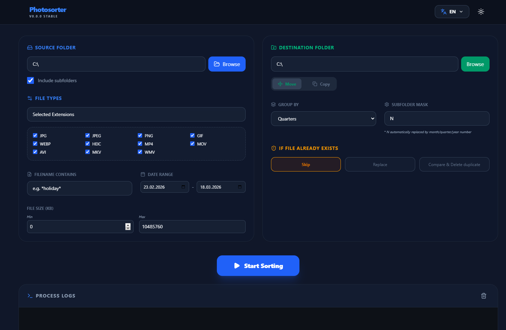

# PhotoSorter

**PhotoSorter** is a high-performance desktop application built with Electron, React, and Vite, designed to organize messy photo and video archives into a clean, chronological folder structure.

## Key Features

- **Advanced Filtering**: Sort files by type (Photos, Videos, or Custom extensions), filename patterns, file size, and modification date ranges.
- **Smart Organization**: Automatically group files into folders by **Year**, **Quarter**, or **Month**.
- **Customizable Folder Masks**: Define how your folders should be named using flexible masks.
- **Move or Copy Modes**: Choose whether to keep the original files or relocate them entirely.
- **Conflict Resolution**: Smart handling of existing files—Choose to **Skip**, **Replace**, or **Rename** (using a timestamp suffix) when a conflict occurs.
- **Real-time Logging**: Instantly monitor every file operation with a color-coded log viewer (move, copy, skip, and errors).
- **Modern & Secure**: Built on a secure IPC-only architecture where the renderer process has zero direct access to the filesystem.

## Getting Started

### Prerequisites

- [Node.js](https://nodejs.org/) (version 18 or higher)
- [npm](https://www.npmjs.com/) (usually bundled with Node.js)

### Installation

1. Clone the repository:
   ```bash
   git clone <repository-url>
   cd photosorter
   ```

2. Install dependencies:
   ```bash
   npm install
   ```

### Running in Development

To start the application in development mode with hot-reloading:
```bash
npm run dev
```

## Building and Packaging

The application uses `electron-builder` to package the app into a standalone executable.

### For Current System

To build and package the application for your current operating system (Windows, macOS, or Linux):
```bash
npm run build
```

The packaged application will be generated in the `dist` folder.

### Multi-platform Compilation

If you want to compile for other systems, you can use the following `electron-builder` commands (requires appropriate build environment):

- **Windows**: `npx electron-builder --win`
- **macOS**: `npx electron-builder --mac` (requires a Mac for code signing)
- **Linux**: `npx electron-builder --linux`

Note: Building for a different architecture might require cross-compilation tools or running the build on a CI/CD platform (like GitHub Actions).

## Tech Stack

- **Frontend**: [React](https://reactjs.org/), [Vite](https://vitejs.dev/)
- **Backend**: [Electron](https://www.electronjs.org/)
- **Styling**: [Tailwind CSS](https://tailwindcss.com/), [Lucide React](https://lucide.dev/) (icons)
- **Localization**: [i18next](https://www.i18next.com/)

## License

This project is licensed under the MIT License - see the [LICENSE](LICENSE) file for details.


## Screenshots

